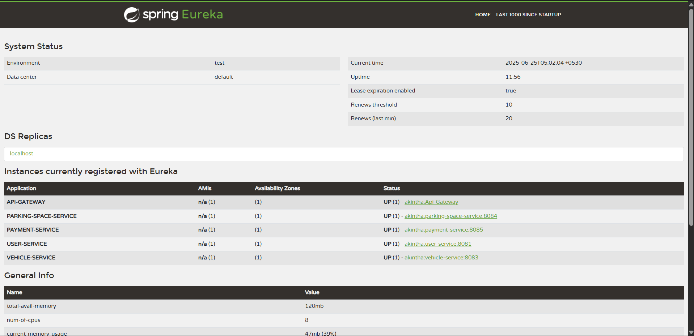

# 🚗 Smart Parking Management System

Welcome to the **Smart Parking Management System** — a microservices-based solution to simplify urban parking management. This project handles vehicle parking, payments, and service registrations with seamless integrations.

---

## 📋 Resources

- **Postman Collection:**  
  Test all APIs easily with the ready-to-use Postman collection.  
  [Postman Collection](./postman_collection.json)

- **Eureka Dashboard:**  
  Visualize all registered services on the Eureka dashboard.  
  

---

## 🚀 Features

- User and Vehicle Management  
- Real-time Parking Space Allocation  
- Payment Processing (Card & Cash)  
- Digital Receipt Generation (PDF)  
- Service Discovery with Eureka  
- RESTful APIs with Spring Boot  
- Fault-tolerant communication with RestTemplate  

---

## 📂 Project Structure

/smart-parking-management-system
│
├── payment-service
├── parking-service
├── user-service
├── eureka-server
├── gateway-service
├── /docs
│ └── /screenshots
│ └── eureka_dashboard.png
├── postman_collection.json
└── README.md

---
